# JavaScript--DOM  
### DOM（Document Object Model）- 文档对象模型  
#### DOM是关于如何获取、修改、添加或删除HTML元素的标准  
#### DOM按照层级的形式划分：父节点、子节点、兄弟节点  
#### DOM按照节点类型划分： 
|节点类型值|1|2|3|8|9|  
|-------|-----|-----|----|----|---|
|节点类型|元素节点|属性节点|文本节点|注释节点|document节点|   
 
**注意**  
1.nodeType 返回节点的类型  
2.nodeName 返回节点名称  
3.nodeValue 返回节点的值  
#### DOM方法  
##### document.createElement("标签名") `创建节点`  
	
	var div = document.createElement('div');  
	
	这时就已经创建了一个div标签  
#### appendChild() `给指定元素追加子节点`  
	document.getElementsByTagName('body')[0].appendChild(div);   
	
	这时将上面创建的div标签插入到了body中  
#### insertBefore(插入的元素，参照元素) `插入元素`  
	
	body.insertBefore(div,body.lastElementChild.previousElementSibling);    
	
	将div标签插入到最后一个子节点的上一个兄弟节点处 
	  
#### removeChild() `移除子节点`  
	body.removeChild(body.lastElementChild.previousElementSibling);   
	 
	移除body中最后一个子节点的兄弟节点  
#### replaceChild(替换元素，被替换元素) `替换子节点`  
	
	body.replaceChild(span,body.firstElementChild);  
	  
	将body中的第一个子节点替换成span标签   
#### cloneNode() `克隆节点 接受一个布尔值作为节点`  

**注意：当参数为true时，会克隆元素的innerHTML，false不会,默认是false**  
	
	body.firstElementChild.cloneNode(true);   
	 
	克隆body中的第一个子节点并克隆它的内容  
#### hasChildNodes() `判断指定元素是否拥有子节点，返回布尔值true或false`  
### 获取元素属性   
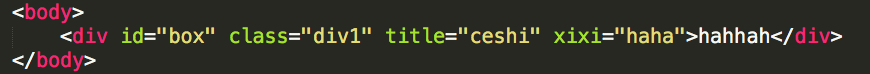 
#### 1.元素.属性名 `获取不到非标准属性`  
**注：如果获取的是元素的class的话，在写的时候必须是className**  
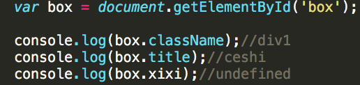  
#### 2.["属性名"] `获不到非标准属性`  
**注：如果获取的是元素的class的话，在写的时候必须是className**  
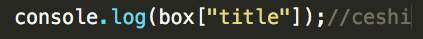  
#### 3.getAttribute("属性名") `获取元素属性 可以获取到元素的自定义属性`  
**注：可以直接写class不用写className**  
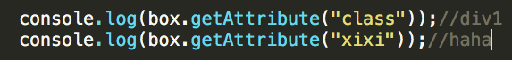  
###### setAttribute("属性名","属性值")  `设置元素属性`  
###### removeAttribute("属性名")  `移除元素属性`  
#### 4.attributes `能访问到元素上所有属性，返回的是一个类数组，可以通过下标的形式拿到每一个属性`  
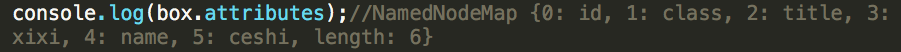  
### 获取子节点的方法   
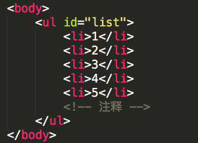 
#### children/childNodes `获取指定元素的第一层子节点`
    
**区别：**  

  	children 在标准浏览器和IE9下，不会造成空白文本解析，获取到的是真实的子节点，不支持IE6、7、8  
  	   
	childNodes 会解析空白文本节点   
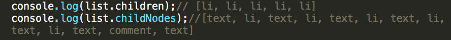
#### firstChild/firstElementChild `获取指定元素的第一个子节点`  
**区别：**  
	
	firstChild 在标准和ie9下会获取到空白文本节点  
	  
	firstElementChild 标准下获取第一个子元素节点，ie6/7/8不支持。  
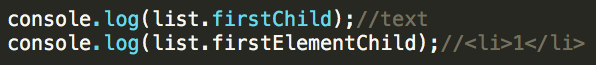  
#### lastChild/lastElementChild `获取指定元素的最后一个子节点`  
**区别:**  
	
	lastChild : 最后一个子节点 在标准和ie9下会获取到空白文本节点。  
	
 	lastElementChild : 标准下获取最后一个子元素节点，ie6/7/8不支持。  
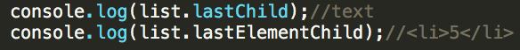  
#### previousSibling/previousElementSibling `获取指定元素的上一个兄弟节点`  
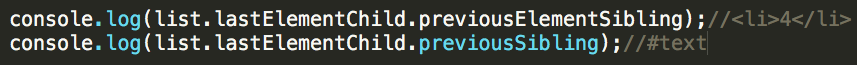  
#### nextSibling/nextElementSibling `获取指定元素的下一个兄弟节点`  
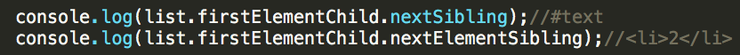  
### 获取父节点   
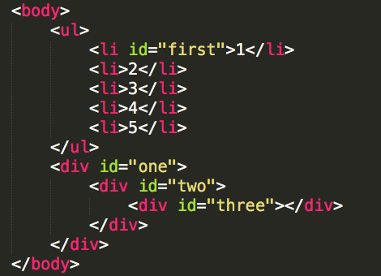 
#### parentNode `获取指定元素的父节点`  
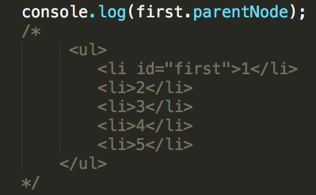  
#### offsetParent `获取离指定元素最近的具有定位属性的祖先节点`  
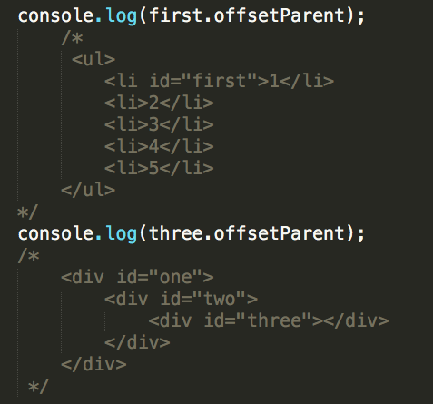   
 
### image对象  
  
##### 实例化图片对象  `var img = new Image(width,height);`     

**接受两个参数，分别代表图片的宽高,直接传数值，不需要加单位,如果只传一个参数，这个参数表示图片的宽度**  

##### 图片的属性  
1. hspace  图片左右的留白/空间  
2. vspace  图片上下的留白/空间  
3. complete 返回浏览器是否已经完成对图像的加载  
   
##### 图片对象事件  
1. onload 图片加载成功时触发的事件  
2. onerror 图片加载失败时触发的事件 
3. onabort 当用户放弃加载时触发的事件  
     
**强调：因为图片是在给定src之后就开始加载，为了避免图片已经加载出来，但是事件还没来得及执行的极端情况，所以我们一般要把图片src的赋值放到最后**  

###DOM事件  

#### window.onload `页面加载完成后触发的事件`  

#### window.onresize `页面调整大小时触发的事件`  

#### window.onscroll `页面滚动时触发的事件`  
	
	获取页面滚动高度  
	1.document.body.scrollTop  谷歌和Safari支持  
	2.document.documentElement.scrollTop 其他浏览器支持  

**获取浏览器窗口可视区域宽高：  
document.documentElement.clientWidth 
document.documentElement.clientHeight**

